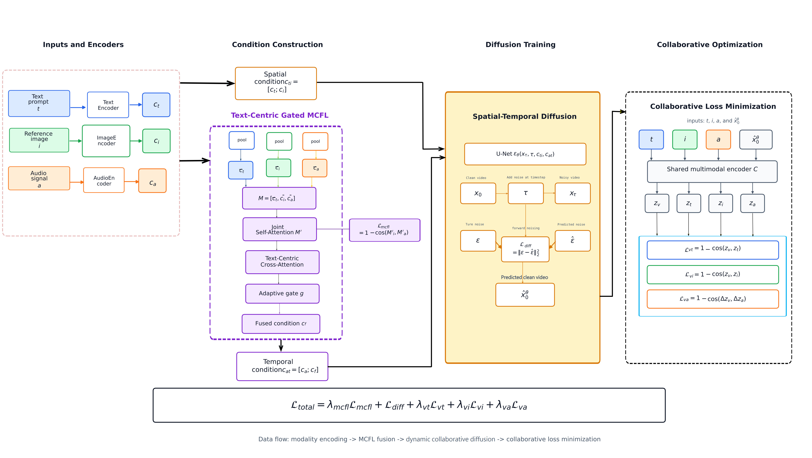

<div align="center">

# DyCoDiff

**Dynamic Collaborative Diffusion for Text-Image-Audio-to-Video Generation**

Official implementation of DyCoDiff, a multimodal diffusion framework for text-image-audio-to-video generation.

[](#environment)
[](#environment)
[](#dycodiff)
[](#news)

</div>

## Table of Contents

- [Overview](#overview)
- [Repository Layout](#repository-layout)
- [Quick Start](#quick-start)
- [Evaluation](#evaluation)
- [Documentation](#documentation)
- [Citation](#citation)

## Overview

DyCoDiff improves the temporal generation stage of a TIA2V diffusion pipeline by encouraging stronger collaboration among text, image, and audio conditions. The paper experiments follow an SHR-disabled protocol so that comparisons focus on temporal condition fusion and collaborative training.

<p align="center">
  
</p>

High-resolution version: [DyCoDiff pipeline PDF](assets/dyco_tia2v_framework.pdf).

### Highlights

| Component | Purpose |
| --- | --- |
| MCFL | Fuses text, image, and audio conditions before temporal generation. |
| Dynamic collaborative loss | Aligns generated videos with text, image, and audio in a shared representation space. |
| Dynamic audio-video objective | Uses temporal feature differences for rhythm-sensitive audio-video alignment. |
| Online baseline attention imitation | Stabilizes temporal attention when MCFL is enabled. |

## News

- Code, training scripts, evaluation scripts, and environment files are released.
- Large assets such as datasets, checkpoints, generated videos, and metric caches are intentionally excluded from Git.

## Resources

| Item | Path |
| --- | --- |
| Full training command | [`docs/TRAINING.md`](docs/TRAINING.md) |
| Evaluation guide | [`EVAL_ALL_README.md`](EVAL_ALL_README.md) |
| Concrete evaluation commands | [`evaluation_scripts/`](evaluation_scripts/) |
| MCFL notes | [`MCFL_TRAINING_README.md`](MCFL_TRAINING_README.md) |
| Training environment | [`environment.yml`](environment.yml) |
| Evaluation environment | [`environment_eval.yml`](environment_eval.yml) |

## Repository Layout

```text
DyCoDiff/
├── diffusion/                  # Diffusion models, training loop, MCFL condition construction
├── tacm/                       # Video data pipeline and model components
├── beats/                      # BEATs audio encoder code
├── scripts/                    # Training, sampling, and utility scripts
├── evaluation_scripts/         # Concrete experiment evaluation commands
├── calculation/                # Metric utilities inherited from the TIA2V codebase
├── RAFT/                       # RAFT code used by optical-flow based evaluation
├── docs/                       # Detailed training and reproduction notes
├── eval_all.py                 # General evaluation entry point
├── eval_all_three_groups.py    # Paper-style three-dataset evaluation entry point
├── environment.yml             # Training environment exported from `tia`
├── environment_eval.yml        # Evaluation environment exported from `eval_mcfl`
└── prompts.txt                 # Text prompts used by CLIP evaluation
```

## Quick Start

### 1. Create Environments

Training environment:

```bash
conda env create -f environment.yml
conda activate dycodiff
```

Evaluation environment:

```bash
conda env create -f environment_eval.yml
conda activate eval_mcfl
```

`environment.yml` was exported from the original training environment `tia` and renamed to `dycodiff`. `environment_eval.yml` was exported from the evaluation environment `eval_mcfl`.

### 2. Prepare Data and Checkpoints

Expected local paths:

```text
datasets/
├── post_audioset_drums/
├── post_landscape/
└── post_URMP/

saved_ckpts/
├── AudioSet-Drums-VAT_tia.pt
├── Landscape-VAT_tia.pt
├── URMP-VAT_tia.pt
├── BEATs_iter3_plus_AS20K.pt
└── omni_encoder.pt
```

Generate the OmniEncoder checkpoint if needed:

```bash
python -m scripts.save_omni_encoder_checkpoint --out saved_ckpts/omni_encoder.pt
```

### 3. Train DyCoDiff

The main paper configuration is provided as:

```bash
bash scripts/train_paper_collab_dynamic_cosine_v7_unified_adaptive.sh
```

By default, it runs on AudioSet-Drums-VAT. Override paths as needed:

```bash
DATA_PATH=datasets/post_landscape \
MODEL_PATH=saved_ckpts/Landscape-VAT_tia.pt \
SAVE_DIR=saved_ckpts/paper_collab_dynamic_cosine_v7_landscape \
bash scripts/train_paper_collab_dynamic_cosine_v7_unified_adaptive.sh
```

For the full command and ablation notes, see [`docs/TRAINING.md`](docs/TRAINING.md).

### 4. Sample Videos

```bash
python -m scripts.sample_motion_optim \
  --resolution 64 \
  --batch_size 1 \
  --diffusion_steps 4000 \
  --noise_schedule cosine \
  --num_channels 64 \
  --num_res_blocks 2 \
  --class_cond False \
  --model_path saved_ckpts/paper_collab_dynamic_cosine_v7_audioset_drums/model020000.pt \
  --num_samples 50 \
  --image_size 64 \
  --learn_sigma True \
  --text_stft_cond \
  --audio_emb_model beats \
  --data_path datasets/post_audioset_drums \
  --in_channels 3 \
  --clip_denoised True \
  --run 11
```

Generated videos are written under `results/` and are ignored by Git.

## Evaluation

DyCoDiff reports FVD, FID, FFC, CLIP, AV-align, and TC_FLICKER.

Paper-style three-dataset evaluation:

```bash
conda activate eval_mcfl
python eval_all_three_groups.py \
  --metrics fvd fid ffc clip av_align tc_flicker \
  --output evaluation_report_three_groups.txt
```

Custom single-dataset evaluation:

```bash
python eval_all.py \
  --real_dir results/9_tacm_/real \
  --baseline_dir results/9_tacm_/fake1_30fps \
  --mcfl_dir results/10_tacm_/fake1_30fps \
  --mcfl2_dir results/11_tacm_/fake1_30fps \
  --metrics fvd fid ffc clip av_align tc_flicker \
  --output evaluation_report_audioset.txt
```

Concrete experiment commands are stored in [`evaluation_scripts/`](evaluation_scripts/). For example:

```bash
bash evaluation_scripts/eval_audioset_run44_no_cache.sh
```

See [`EVAL_ALL_README.md`](EVAL_ALL_README.md) for metric details and evaluation notes.

## Documentation

- [`docs/TRAINING.md`](docs/TRAINING.md): stage-1 content training, DyCoDiff temporal training, full paper command, and ablation settings.
- [`EVAL_ALL_README.md`](EVAL_ALL_README.md): evaluation environment, metric descriptions, and evaluation entry points.
- [`evaluation_scripts/`](evaluation_scripts/): concrete evaluation commands used in experiments.

## Important Notes

- Datasets, checkpoints, generated videos, caches, and reports are not tracked by Git.
- Put CLIP/transformers caches outside Git, such as under `tacm/modules/cache/` or the default Hugging Face cache.
- RAFT weights for optical-flow based evaluation are not included. Put them under `RAFT/models/` or `saved_ckpts/` if needed.
- The repository includes code inherited from TIA2V and related components for reproducibility.

## License

No license has been selected yet. Please contact the authors before public reuse or redistribution.

## Acknowledgements

This repository builds on the TIA2V codebase and related components from Latent Diffusion, BEATs, CLIP, and RAFT.

## Citation

If you find this project useful, please cite DyCoDiff and the TIA2V baseline. The DyCoDiff BibTeX entry will be updated after publication.

```bibtex
@article{zhang2026dycodiff,
  title={DyCoDiff: Dynamic Collaborative Diffusion for Text-Image-Audio-to-Video Generation},
  author={Zhang, Youming and Wang, Wenmin and Chen, Zhongheng and Peng, Zhengyu},
  journal={Preprint},
  year={2026}
}
```
